# Human Faucet

A decentralized ETH faucet powered by **Chainlink CRE** and **World ID** verification. This system allows users to claim small amounts of ETH after verifying their identity through World ID, with built-in cooldown periods to prevent abuse.

## Overview

The Human Faucet is a full-stack application consisting of three main components:

1. **Smart Contract** - An on-chain faucet contract deployed on multiple EVM chains
2. **Chainlink CRE Workflow** - A serverless workflow that verifies World ID proofs and triggers on-chain actions
3. **User Interface** - A Next.js frontend for users to claim faucet rewards

## System Architecture

```
┌─────────────────────────────────────────────────────────────┐
│                        User Interface                       │
│                    (Next.js + World ID)                     │
└────────────────────────────┬────────────────────────────────┘
                             │ HTTP Request
                             │ (World ID Proof + Recipient)
┌────────────────────────────▼────────────────────────────────┐
│              Chainlink CRE Workflow                         │
│   1. Receive HTTP request from UI                           │
│   2. Verify World ID proof off-chain                        │
│   3. Execute on-chain transaction                           │
└────────────────────────────┬────────────────────────────────┘
                             │ Chain Write
┌────────────────────────────▼────────────────────────────────┐
│                   Smart Contract                            │
│           (HumanFaucet, deployed on multiple chains)        │
│   - Verify forwarder address                                │
│   - Check cooldown periods                                  │
│   - Drip ETH to recipient                                   │
└─────────────────────────────────────────────────────────────┘
```

## Project Structure

```
human-faucet/
├── contracts/              # Solidity smart contracts
│   ├── src/
│   │   ├── HumanFaucet.sol          # Main faucet contract
│   │   └── interfaces/              # Contract interfaces
│   ├── test/
│   │   └── HumanFaucet.t.sol        # Contract tests
│   ├── script/                      # Deployment scripts
│   ├── lib/                         # Dependencies (forge-std, OpenZeppelin)
│   └── foundry.toml                 # Foundry configuration
│
├── human-faucet-workflow/  # Chainlink CRE workflow
│   ├── main.ts                      # Workflow entry point
│   ├── httpCallback.ts              # HTTP trigger handler
│   ├── api.ts                       # wrapped workflow as an API
│   ├── workflow.yaml                # Workflow configuration
│   ├── config.staging.json          # Staging configuration
│   ├── config.production.json       # Production configuration
│   └── package.json
│
├── ui/                     # Next.js frontend application
│   ├── src/
│   │   └── app/
│   │       ├── page.tsx             # Main page
│   │       ├── layout.tsx           # Root layout
│   │       └── globals.css          # Global styles
│   ├── public/                      # Static assets
│   ├── next.config.ts               # Next.js configuration
│   ├── tailwind.config.mjs          # Tailwind CSS configuration
│   └── package.json
│
└── README.md               # This file
```

## Components

### 1. Architecture Overview

```mermaid
flowchart LR
subgraph FRONTEND["USER & FRONTEND"]
direction TB
UIStart["User clicks Verify &amp; Claim<br>(Selects Chain &amp; Address)"]
PreCheck{"Is Cooldown<br>passed?<br>(EVM Read)"}
WaitError["Show Cooldown<br>Error on UI"]
IDKit["World ID App generates ZKP<br>(Signal = Recipient)"]
PostAPI["POST payload to<br>CRE HTTP Trigger"]
end
subgraph CRE["OFF CHAIN - CHAINLINK CRE"]
direction TB
Receive["CRE parses Payload<br>&amp; extracts chainId"]
VerifyAPI{"Is World ID<br>Proof Valid?<br>(Cloud API v2)"}
APIError["Return 500:<br>Invalid Proof Error"]
Encode["Encode EVM payload<br>(recipient, nullifierHash)"]
SignReport["Generate &amp; Sign<br>EVM Report"]
SubmitTx["Trigger EVM Write via<br>CRE Forwarder"]
end
subgraph DESTINATION["DESTINATION CHAIN - SEPOLIA / ARBITRUM"]
direction TB
ProcessReport["CRE Forwarder calls<br>_processReport()"]
CheckNullifier{"Is Nullifier<br>Cooldown passed?"}
RevertCooldown["Tx Reverts:<br>FaucetCooldownActive"]
CheckBalance{"Contract has<br>enough ETH?"}
RevertBalance["Tx Reverts:<br>InsufficientBalance"]
Transfer["Transfer ETH to<br>Recipient Address"]
EmitEvent["Emit FaucetDripped<br>Event &amp; Return Hash"]
end
UIStart --> PreCheck
PreCheck -- no --> WaitError
PreCheck -- yes --> IDKit
IDKit --> PostAPI
PostAPI --> Receive
Receive --> VerifyAPI
VerifyAPI -- no (API Rejects) --> APIError
VerifyAPI -- yes (Status 200) --> Encode
Encode --> SignReport
SignReport --> SubmitTx
SubmitTx --> ProcessReport
ProcessReport --> CheckNullifier
CheckNullifier -- no --> RevertCooldown
CheckNullifier -- yes --> CheckBalance
CheckBalance -- no --> RevertBalance
CheckBalance -- yes --> Transfer
Transfer --> EmitEvent
EmitEvent -. Return TxHash .-> PostAPI

     UIStart:::startNode
     PreCheck:::decisionNode
     WaitError:::errorNode
     IDKit:::processNode
     PostAPI:::processNode
     Receive:::processNode
     VerifyAPI:::decisionNode
     APIError:::errorNode
     Encode:::processNode
     SignReport:::processNode
     SubmitTx:::processNode
     ProcessReport:::processNode
     CheckNullifier:::decisionNode
     RevertCooldown:::errorNode
     CheckBalance:::decisionNode
     RevertBalance:::errorNode
     Transfer:::processNode
     EmitEvent:::successNode
    classDef startNode fill:#f0fdf4,stroke:#22c55e,stroke-width:2px,color:#000
    classDef processNode fill:#eff6ff,stroke:#3b82f6,stroke-width:1px,color:#000,rx:5,ry:5
    classDef decisionNode fill:#eff6ff,stroke:#3b82f6,stroke-width:1px,color:#000,rx:20,ry:20
    classDef errorNode fill:#fef2f2,stroke:#ef4444,stroke-width:2px,color:#000
    classDef successNode fill:#f0fdf4,stroke:#22c55e,stroke-width:2px,color:#000
```



### 2. Smart Contract (`contracts/`)

**HumanFaucet.sol** is an EVM-compatible smart contract that implements the core faucet logic.

#### Key Features:

- **Drip Distribution**: Distributes a configurable amount of ETH per claim
- **World ID Verification**: Uses nullifier hashes to ensure each verified human can only claim once per day
- **Daily Cooldown**: Enforces a 24-hour cooldown period between claims per nullifier hash
- **Owner Controls**: Only the contract owner can:
  - Set the faucet amount (in wei)
  - Withdraw remaining ETH
- **CRE Integration**: Accepts authenticated calls from the Chainlink CRE forwarder address

#### Deployed Addresses:

- **Sepolia**: `0xBcbE48B2cAac8645cF9528415244369c4c7466C1`
- **Arbitrum Sepolia**: `0x880D2Cc47742387815b1326082D77B92b9Eca922`

#### Contract Overview:

```solidity
// Main public functions
function withdraw() external onlyOwner;
function setFaucetAmount(uint256 amount) external onlyOwner;
function getNextDripTime(uint256 nullifierHash) external view returns (uint256);

// Called internally by CRE workflow
function _dripFaucet(address recipient, uint256 nullifierHash) internal;
```

### 3. Chainlink CRE Workflow (`human-faucet-workflow/`)

A TypeScript serverless workflow that orchestrates the entire claim process using Chainlink's Compute, Route, and Execute (CRE) platform.

#### Workflow Steps:

1. **HTTP Trigger**: User submits a claim request from the UI containing:
   - `recipient`: Ethereum address to receive ETH
   - `nullifier_hash`: User's World ID nullifier hash
   - `merkle_root`: Latest Merkle root from World ID
   - `proof`: Zero-knowledge proof from World ID
   - `verification_level`: Level of World ID verification (orb or device)
   - `chainId`: Target blockchain (1 for Sepolia, 42161 for Arbitrum)

2. **Off-Chain Verification**: The workflow verifies the World ID proof with Worldcoin's API
   - Ensures the proof is valid and not replayed
   - Confirms the verification level matches expectations

3. **On-Chain Execution**: Upon successful verification, the workflow:
   - Encodes the recipient and nullifier hash as ABI-encoded parameters
   - Submits a signed transaction to the HumanFaucet contract
   - Monitors the transaction to ensure successful execution

#### Configuration:

- **Staging**: Uses staging World ID and contract addresses
- **Production**: Uses production World ID and mainnet contract addresses

### 4. User Interface (`ui/`)

A modern Next.js web application that provides a user-friendly interface for claiming faucet rewards.

#### Key Features:

- **World ID Integration**: Seamlessly integrates with World ID via `@worldcoin/idkit`
- **Multi-Chain Support**: Users can select their target blockchain (Sepolia or Arbitrum Sepolia)
- **Real-Time Feedback**: Visual feedback during verification and claim processing
- **Responsive Design**: Built with Tailwind CSS for mobile and desktop compatibility

#### Technology Stack:

- **Framework**: Next.js 16 with App Router
- **Styling**: Tailwind CSS
- **Blockchain**: Viem for Ethereum interactions
- **World ID**: Official Worldcoin IDKit library
- **Language**: TypeScript

#### User Flow:

1. User opens the application and selects target blockchain
2. User initiates World ID verification through the IDKit modal
3. After successful verification, user submits claim request
4. Workflow processes the claim and drips ETH on-chain
5. User receives confirmation of successful claim

## Getting Started

### Prerequisites

- Node.js 18+ and npm or bun
- Foundry (for smart contract development)
- World ID credentials (app ID and action)
- Funded private key (for workflow execution)

### Setup Instructions

#### 1. Smart Contracts

```bash
cd contracts
forge install
forge test
```

#### 2. Workflow

```bash
cd human-faucet-workflow
bun install  # or npm install

# Setup environment
cp ../.env.example .env
# Add your World ID app ID and action to .env

# Simulate workflow
cre workflow simulate human-faucet-workflow
```

#### 3. UI

```bash
cd ui
bun install
cp .env.example .env.local

# Development
bun dev
```

## Configuration

### Environment Variables

Create a `.env` file in the project root with the following variables:

```bash
# Chainlink CRE
CRE_ETH_PRIVATE_KEY=<your_private_key>

# World ID
WORLD_ID_APP_ID=<your_worldcoin_app_id>
WORLD_ID_ACTION=<your_worldcoin_action>

# Smart Contract Addresses
SEPOLIA_CRE_FORWARDER_ADDRESS=<forwarder_address>
ARB_SEPOLIA_CRE_FORWARDER_ADDRESS=<forwarder_address>

# Etherscan API Key (for verification)
ETHERSCAN_API_KEY=<your_api_key>
```

## Deployment

### Deploy Smart Contract

#### Sepolia:

```bash
cd contracts
source ../.env
forge create src/HumanFaucet.sol:HumanFaucet \
  --rpc-url "https://ethereum-sepolia-rpc.publicnode.com" \
  --private-key $CRE_ETH_PRIVATE_KEY \
  --broadcast \
  --constructor-args $SEPOLIA_CRE_FORWARDER_ADDRESS
```

#### Arbitrum Sepolia:

```bash
cd contracts
source ../.env
forge create src/HumanFaucet.sol:HumanFaucet \
  --rpc-url "https://sepolia-rollup.arbitrum.io/rpc" \
  --private-key $CRE_ETH_PRIVATE_KEY \
  --broadcast \
  --constructor-args $ARB_SEPOLIA_CRE_FORWARDER_ADDRESS
```

#### Other CRE supported network

- you can deploy the faucet contract on any network that support Chainlink CRE

- for simplicity, we just deployed on Sepolia and Arbitrum Sepolia

### Deploy UI

Deploy to Vercel (recommended for Next.js):

```bash
npm install -g vercel
cd ui
vercel deploy --prod
```

Or deploy to your preferred hosting platform as a standard Next.js application.

## Security Considerations

### Smart Contract

- **Forwarder Authentication**: Contract only accepts calls from the configured CRE forwarder address
- **Nullifier Hash Tracking**: Uses mapping to track when each user last claimed
- **Cooldown Enforcement**: Prevents rapid successive claims within 24-hour windows
- **Owner Controls**: Sensitive functions are restricted to contract owner

### Workflow

- **Off-Chain Verification**: World ID proofs are verified with Worldcoin's official API before any on-chain action
- **Proof Replay Protection**: Each nullifier hash can only be used once
- **Signed Transactions**: All on-chain transactions are signed by the owner's private key

### Frontend

- **Client-Side Validation**: Input validation before submission
- **World ID Security**: Uses official Worldcoin IDKit library with built-in security features
- **HTTPS Only**: All network requests should use HTTPS in production

## Testing

### Smart Contract Tests

```bash
cd contracts
forge test
```

### Workflow Simulation

```bash
cd human-faucet-workflow
cre workflow simulate ./main.ts --target=staging-settings
```

## Architecture Decisions

### Why Chainlink CRE?

- **Decentralization**: Serverless execution without a centralized backend
- **Security**: Tamper-proof execution and transaction signing
- **Cost Efficiency**: Pay only for actual computation and gas costs
- **Flexibility**: Easy to modify verification logic or add new chains

### Why World ID?

- **Privacy**: Zero-knowledge proofs preserve user privacy while ensuring uniqueness
- **Sybil Resistance**: Ensures each claim comes from a verified unique human
- **User-Friendly**: Seamless authentication experience
- **Decentralized**: Access to verified identity data without central authority

### Why Multi-Chain?

- **Accessibility**: Users on different networks can participate
- **Scalability**: Distributes claim load across multiple blockchains
- **Future-Proof**: Easy to add support for additional EVM chains

## Monitoring & Troubleshooting

### Contract Events

Monitor `FaucetDripped` events to track successful claims:

```javascript
contract.on("FaucetDripped", (recipient, amount) => {
  console.log(`Faucet dripped ${amount} wei to ${recipient}`);
});
```

### Workflow Logs

Stream workflow execution logs:

```bash
cre workflow logs --workflow-name="human-faucet-workflow-production"
```

### Common Issues

**Q: "FaucetCooldownActive" error**

- User is attempting to claim within 24 hours of their last claim
- Check `getNextDripTime()` view function for next available claim time

**Q: "InsufficientBalance" error**

- Contract doesn't have enough ETH in balance
- Owner needs to fund the contract with ETH

**Q: "World ID verification failed" error**

- Proof is invalid or expired
- Check that the proof was generated with the correct app ID and action

## Contributing

Contributions are welcome! Please ensure:

1. Smart contract changes pass all tests
2. Workflow changes are tested with simulation
3. UI changes maintain responsive design and accessibility
4. All code follows project style guidelines

## License

This project is licensed under the MIT License - see LICENSE file for details.

## Support

For support, issues, or questions:

- Review existing documentation in each component's README
- Check Chainlink CRE documentation: https://chain.link/cross-chain-coordination
- Check World ID documentation: https://docs.worldcoin.org/
- Review contract interfaces in `contracts/src/interfaces/`

## Acknowledgments

Built with:

- [Chainlink CRE](https://docs.chain.link/cre) - Decentralized workflow execution
- [World ID](https://worldcoin.org/) - Privacy-preserving identity verification
- [Foundry](https://book.getfoundry.sh/) - Solidity development framework
- [Next.js](https://nextjs.org/) - React framework
- [Viem](https://viem.sh/) - Ethereum JavaScript client
